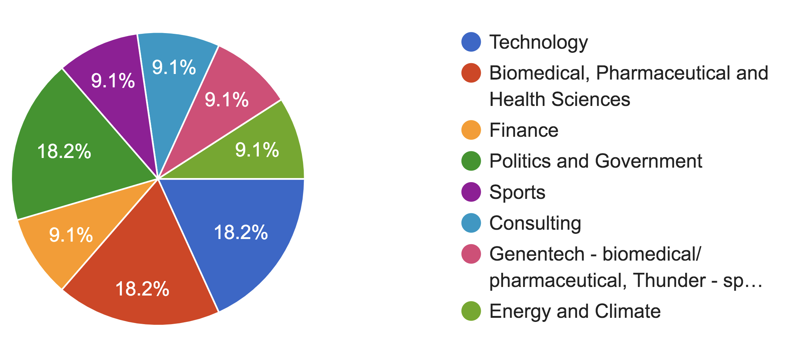
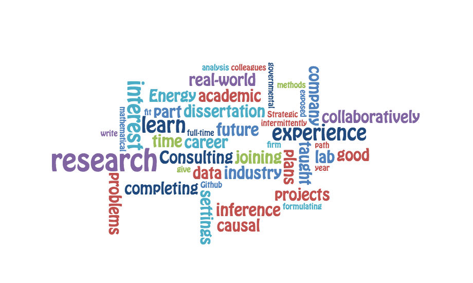

**(Last Updated: 11/15/2021)**

The Statistics department is enthusiastic about summer internships, and it is common among graduate students to do an internship over the summer. 

Here are some reasons to consider an internship.

- It's a nice break from your research that you're working hard on during the rest of the year. 
- It's a good way to explore work culture outside of an academic setting.
- It can help you better figure out your research interests and your future career path. 

Graduate students have interned at a wide range of companies and organizations that span multiple fields. Here are some examples (note categories are arbitrary, as some companies probably fall under multiple ones)

- **Biomedical, pharmaceutical and health sciences:** 23andMe, Genentech
- **Consulting:** Berry Consultants
- **Finance:** Citadel
- **Government Organizations:** Argonne National Laboratory, Los Alamos National Laboratory
- **Sports:** Oakland A's, Oklahoma City Thunder, SF Giants
- **Technology:** Amazon, Ebay, Facebook, Google, Netflix, Stitch Fix, Uber

## 2021 Fall Survey

Based on a survey conducted Fall 2021, several Statistics PhD students have recently interned at companies covering at least 8 fields.

Here are some high-level findings from this survey. (A link to the complete results is available to all SGSA members and can be provided upon request.) 

1. **What did you do at your organization or company?** 

    Writing long R scripts, running statistical algorithms to speed up pipelines, implementing results from PhD work --- you name it! Here's a word cloud summary, would also recommend reading the complete survey responses. 

    

2. **How did you hear about and secure the internship?**
        
    Respondents report hearing from their PhD advisors, other PhD students (not necessarily in Statistics) and acquaintances working at the company. Many also actively seek out available internships that match their interests. Occasionally (e.g., Citadel), the internship is offered alongside fellowship funding.   

3. **How was the internship helpful?**

    From improvements in coding to gaining teamwork skills, from applying PhD research to picking up new research directions, respondents report a range of nourishing and useful take-aways from their summer experiences. Here's a word cloud, but again would recommend reading the complete survey responses.

     

## More Sharing (2016 and before)

Shared below are the experiences of some students who have already graduated.

### Rebecca Barter (Google, Summer of 2016)

I worked on the Ads Metric Team at Google in Seattle during the summer of 2016 (at the end of my Second year). I was put in touch with a few members of the team by another grad student who had worked with them as a full-time Google employee in the past. Throughout my internship, I learnt a huge amount of things (mainly from just being around and talking to a bunch of smart and creative people), and I got to live in Seattle for a few months which is an awesome city! The interview process was via phone, and I was asked a few questions about things like visualizing big data and conducing hypothesis testing. Overall it was a really good experience, and I would highly recommend considering Google as a place to do an internship. Next summer I'll probably do an internship at a company that is more closely related to my interests in health.

### Jamie Murdoch (Facebook, Summer of 2016)

I'm a second year, and worked at Facebook's AI Research (FAIR) group in New York City after my first year. One of my advisors at Berkeley knew a researcher at Facebook and recommended me for the position. I did academic research in deep learning applied to NLP, which will (hopefully!) result in a publication and help build towards my thesis. My day-to-day activities were basically the same as being at Berkeley - reading papers, thinking about models and writing code, except that I wasn't taking any classes. There were a lot of interns from various other top schools, particularly NYU (home of Yann Lecun), and I learned a lot from conversations both at work and over a beer about various aspects of deep learning that don't necessarily show up in research papers. The most interesting part was getting to see the advantages to my research of having access to a massive GPU cluster. For those interested in deep learning, doing an internship is somewhat unique in that you can continue doing the same research you were doing at Berkeley, but with access to a different set of people, massive computational power and very generous pay.

### Jonathan Fischer (Oakland A's, Summer of 2016)

I interned with the Oakland A's in the Baseball Operations department from June through August of 2016. They reached out to me due to a mutual acquaintance whom I had met because of a job solicitation email sent to grad students a couple of years prior. I did some data mining in Python and most of my statistical analyses in R, primarily applying machine learning algorithms to model player effectiveness. Being involved in a workplace setting was a nice change of pace from academic life, and it was certainly different to be surrounded by people working on things with no relation to stats. While building models was fun, the highlight of the summer was probably being allowed to participate in the mascot race between the 6th and 7th innings during a home game.